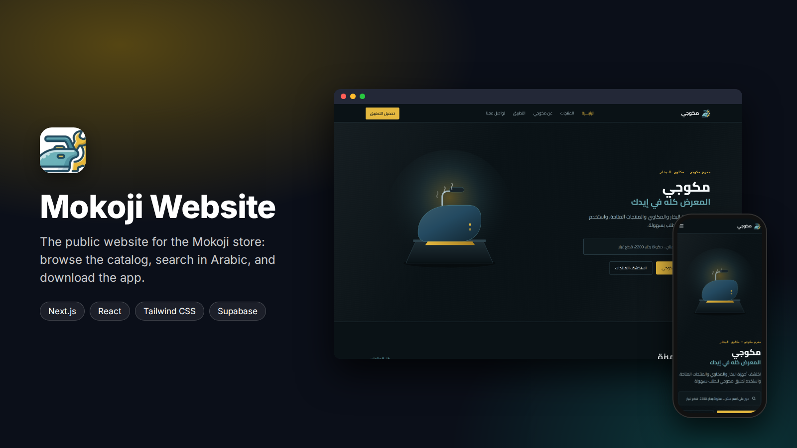
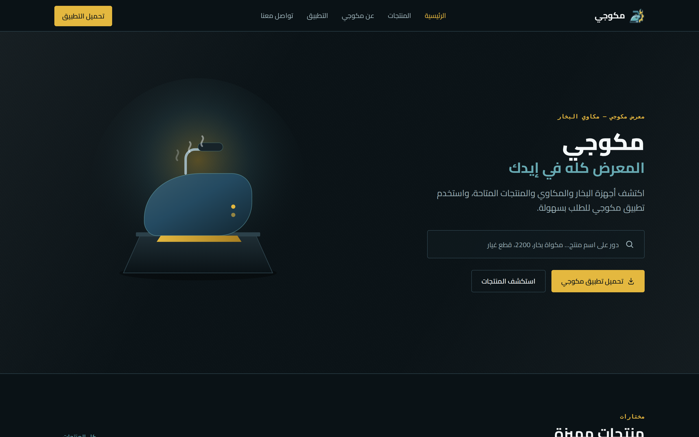
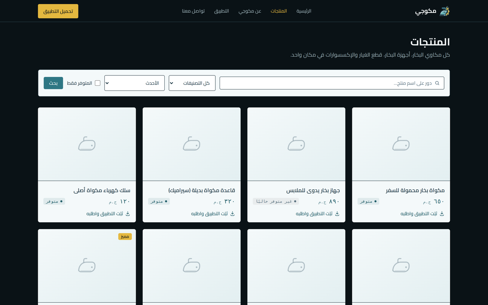
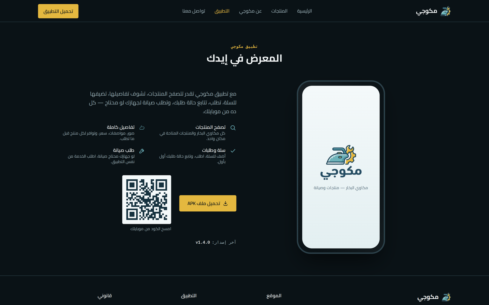
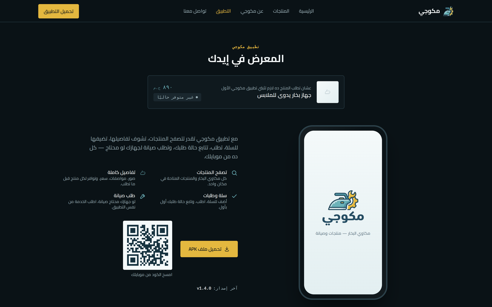
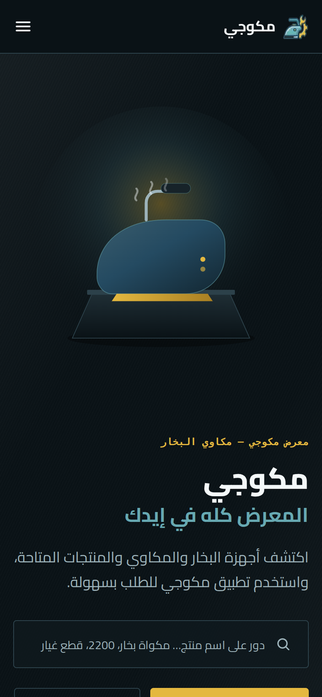

<div align="center">



<br/>

[](https://nextjs.org)
[](https://react.dev)
[](https://www.typescriptlang.org)
[](https://tailwindcss.com)
[](#deployment)

**The public website of Mokoji, a steam iron showroom.**
Visitors browse the product catalog, search in Arabic and download the Android app.
Ordering and payment happen inside the app; the site is the shop window.

موقع مكوجي التعريفي — عرض المنتجات والبحث بالعربي وتحميل التطبيق.

</div>

---

## Screenshots


<p align="center"><sub><b>Home</b> · hero with search, featured products, categories, how ordering works, app download</sub></p>

<table>
  <tr>
    <td width="50%"><br/><sub><b>Products</b> · search, category and sort filters, availability</sub></td>
    <td width="50%"><br/><sub><b>Get the app</b> · APK download, QR code and release version</sub></td>
  </tr>
  <tr>
    <td width="50%"><br/><sub><b>Product page</b> · price, stock status and a link to order in the app</sub></td>
    <td width="50%" align="center"><br/><sub><b>Mobile</b> · fully responsive</sub></td>
  </tr>
</table>

## Features

- **Live catalog** from the same Supabase database the Mokoji app uses, limited to published products through a dedicated read-only migration
- **Arabic search** with autocomplete; queries are normalized with the same rules the database uses (alef forms, taa marbuta, diacritics), and the search endpoint is rate-limited
- **Product pages** with gallery, specs table and availability
- **App download** page with APK link, QR code and release information
- **SEO:** generated `sitemap.xml` and `robots.txt`, per-page metadata
- **Pages:** Home, Products, Product details, App, About, Contact, Privacy, Terms
- **Mock catalog mode** to run the site without a database

## Tech stack

| Area | Choice |
|:--|:--|
| Framework | Next.js 16 (App Router), React 19, TypeScript |
| Styling | Tailwind CSS 4, custom Arabic fonts, RTL layout |
| Data | `@supabase/supabase-js` calling read-only RPCs |
| QR codes | `qrcode.react` |
| Hosting | Cloudflare Workers through OpenNext |

```
src/
  app/                  pages (home, products, product/[slug], app, about, contact, privacy, terms)
    api/search/         autocomplete endpoint with simple rate limiting
  components/           header, footer, hero, product grid and cards, filters, download section, ...
  lib/data/products.ts  data access: Supabase RPCs or the local mock catalog
  lib/search/           Arabic text normalization
  lib/mock/             sample catalog
supabase/               the migration that exposes published products to the site
```

## Getting started

```bash
npm install
cp .env.example .env.local     # fill in the values, see the comments in the file
npm run dev                    # http://localhost:3000
```

Set `NEXT_PUBLIC_USE_MOCK_CATALOG=true` to run with the sample catalog and no database.

Before using real data, apply `supabase/migrations/0076_public_website_catalog_access.sql`
to the Supabase project (details in [`supabase/README.md`](supabase/README.md)).

| Variable | Purpose |
|:--|:--|
| `NEXT_PUBLIC_SUPABASE_URL`, `NEXT_PUBLIC_SUPABASE_ANON_KEY` | Supabase project |
| `NEXT_PUBLIC_USE_MOCK_CATALOG` | `true` for the sample catalog |
| `NEXT_PUBLIC_APK_URL`, `NEXT_PUBLIC_PLAY_STORE_URL` | download links |
| `NEXT_PUBLIC_APP_VERSION`, `NEXT_PUBLIC_APP_RELEASE_DATE` | shown on the app page |
| `NEXT_PUBLIC_CONTACT_PHONE`, `_WHATSAPP`, `_EMAIL` | contact details |
| `NEXT_PUBLIC_SITE_URL` | canonical URL for the sitemap and SEO |

## Deployment

The project deploys to **Cloudflare Workers** with [OpenNext](https://opennext.js.org/cloudflare).

```bash
npx wrangler login     # once
npm run cf:deploy
```

For automatic deploys, import the repository in Cloudflare (Workers & Pages → Create → Import from Git),
use `npm run cf:deploy` as the build command, and add the variables from `.env.local` in the Worker settings.

The Android APK is hosted as a GitHub Release asset, because Workers rejects files over 25 MB.

## Related

- [Mokoji app](https://github.com/osama-Yosef/steam-gallery-app): the Flutter app and Supabase backend this site reads from.

## Author

**Osama Yosef** · Flutter developer, Cairo

[](https://github.com/osama-Yosef)
[](https://www.linkedin.com/in/osama-yosef-819268319)
[](https://upwork.com/freelancers/~014ebd205ef38ca04c)
[](mailto:osamayosef038@gmail.com)
